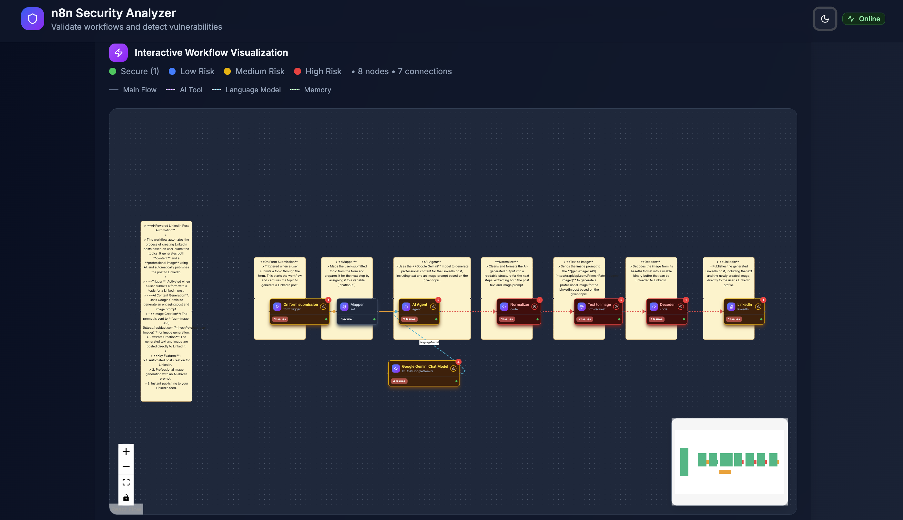

# n8n-scanner

**n8n-scanner** is a free and open-source web application that helps you identify security vulnerabilities in your n8n workflows. Upload your n8n workflow JSON file, and the app will analyze workflow nodes for **OWASP LLM Top 10**, **OWASP Agentic AI Security**, **OWASP Web Application Security**, and **n8n Security Best Practices**. Results include an interactive visualization that highlights security issues at the node level, and a summary report for your records.

## Features

- **Upload n8n Workflow JSON:** Easily load exported workflows for analysis.
- **Automated Security Scanning:** Checks each node against multiple security frameworks:
    - OWASP LLM Top 10
    - OWASP Agentic AI Security
    - OWASP Web Application Security
    - n8n Security Best Practices
- **Interactive Visualization:** View your workflow as an interactive graph, with nodes flagged if issues are detected.
- **Comprehensive Reporting:** Generate and export a summary security report.
- **Completely In-browser:** All analysis is client-side; your workflow data stays private.

## Demo

Try it online: [https://n8n-scanner.vercel.app/](https://n8n-scanner.vercel.app/)

## Table of Contents

- [Features](#features)
- [Demo](#demo)
- [Getting Started](#getting-started)
- [Usage](#usage)
- [Security Frameworks](#security-frameworks)
- [License](#license)

## Getting Started

To run the app locally:

1. git clone https://github.com/yourusername/n8n-scanner.git
2. cd n8n-scanner
3. npm install
4. npm run dev

Or deploy directly to Vercel.

## Usage

1. Load the web app.
2. Click **Upload Workflow** and select your `workflow.json` file exported from n8n.
3. Review the interactive workflow graph. Nodes with detected security issues will be **highlighted**.
4. Hover over any node for details about risk findings and recommendations.
5. Optionally, you can export a PDF or text summary report for your records.

*Sample illustration:*

## Security Frameworks

Analysis currently covers:

- **OWASP LLM Top 10:** Leading risks for Large Language Model integrations.
- **OWASP Agentic AI Security:** Risks related to agentic or autonomous features in automation[2].
- **OWASP Web Application Security:** Broad risks such as injection, XSS, unsafe deserialization, etc.
- **n8n Security Best Practices:** Custom checks for workflow configuration, credentials, and access control.

## License

[MIT](LICENSE)

---

*This project is not affiliated with n8n or the OWASP Foundation. See each framework’s respective documentation for more information.*